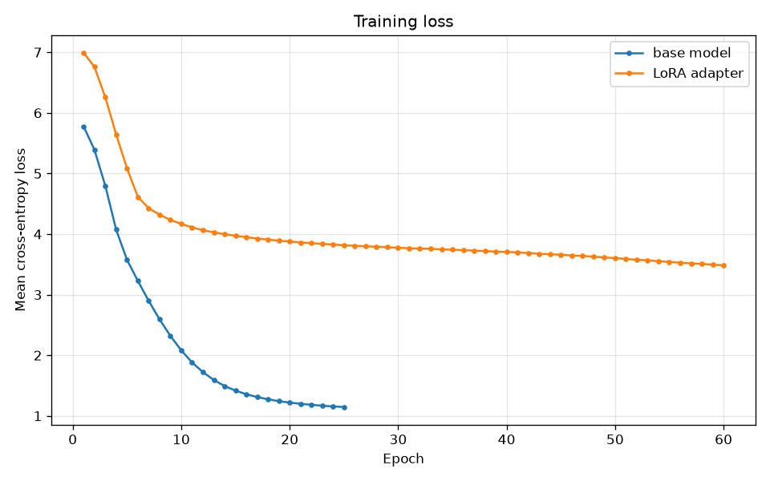
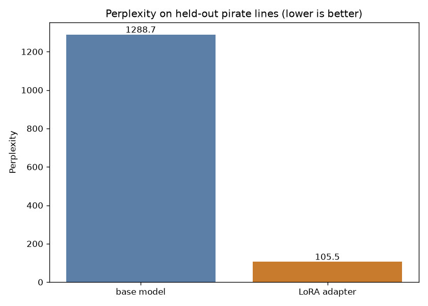

# LoRA Lab

Fine-tune a tiny language model with a LoRA-style adapter, then A/B the
adapted model against the base model side by side. The demo teaches the
model to talk like a pirate.

This is a from-scratch implementation in numpy. No PyTorch, no
transformers library, no API calls. The base model is a small neural
n-gram language model, and the adapter is a genuine low-rank update
(`W_new = W_base + (alpha/rank) * B @ A`) trained with gradients while
every base weight stays frozen. It is the real LoRA mechanism, just at
toy scale. See [SCALING.md](SCALING.md) for how to swap in production
LoRA with `peft` and Hugging Face transformers.

## Demo

```
Prompt: "we sail at dawn"

--- BASE MODEL ---
we sail at dawn our team meets every tuesday the couch loves salad

--- LORA PIRATE MODEL ---
we sail at dawn a sight a winds and em a sailor never sea the gold lads ye his waters keep lad
```

Same prompt, same seed. The base model learned plain English from a
generic corpus. The adapter (rank 8, only 9.6% of base parameters)
steered it into pirate speak.

## Features

- Tiny neural language model (embedding + tanh MLP + softmax) written
  from scratch in numpy, with hand-derived backprop
- LoRA-style adapter: base weights frozen by construction, only the
  low-rank matrices `B` and `A` receive gradients; zero-initialized so
  the adapted model equals the base model before training
- Training pipeline with mini-batch Adam, train/val splits, and loss
  logging (`train.py`)
- Side-by-side A/B generation CLI (`compare.py`) and a Flask web UI
  (`app.py`) with temperature and length controls
- Metrics module: perplexity before/after on held-out pirate lines,
  plus saved loss-curve and perplexity charts
- Bundled corpora: 320 lines of neutral English and 265 lines of
  original pirate speak (`data/`)
- Test suite covering the tokenizer, gradients, adapter equivalence,
  frozen-base training, and deterministic generation

## Results (from the bundled training run)

| | Base model | + LoRA adapter |
|---|---|---|
| Trainable params | 35,799 | 3,448 (9.6% of base) |
| Perplexity on held-out pirate lines | 1288.7 | 105.5 |

That is a 91.8% perplexity improvement from an adapter that touches
less than a tenth of the parameters.

## How to run

```bash
pip install -r requirements.txt

# Train the base model, then the pirate adapter (about 10 seconds on CPU)
python train.py

# A/B the two models on your own prompt
python compare.py --prompt "the treasure is" --temperature 0.8

# Web UI: base vs pirate panels side by side
python app.py
# then open http://127.0.0.1:5000

# Tests
pytest
```

`train.py` saves weights to `weights/` (`base.npz`, `lora_adapter.npz`,
`vocab.json`) and charts to `charts/`. Useful flags: `--epochs-base`,
`--epochs-adapter`, `--rank`, `--lr-adapter`, `--temperature`.

## Screenshots

Training loss curves for the base model and the adapter:



Perplexity on held-out pirate lines, before and after the adapter:



## Project structure

```
loralab/
  tokenizer.py   word-level tokenizer with <pad>/<bos>/<eos>/<unk>
  data.py        corpus loading, train/val split, mini-batch iteration
  model.py       TinyLM: numpy n-gram LM, forward/backprop, sampling
  adapter.py     LoRAAdapter: frozen base + trainable low-rank update
  train.py       mini-batch Adam optimizer and training loops
  metrics.py     perplexity + matplotlib chart helpers
train.py         end-to-end pipeline: train base, train adapter, plot
compare.py       CLI: generate from base and adapter side by side
app.py           Flask web UI
data/            base_corpus.txt, pirate_corpus.txt
tests/           pytest suite
weights/         trained weights and vocabulary (committed for the demo)
charts/          loss and perplexity plots
SCALING.md       how to do this for real with peft + transformers
```

## Tech highlights

- Exact LoRA reparameterization on the output projection, with the
  standard `alpha/rank` scaling and zero-init `B`
- Gradients for the adapter derived by the chain rule through the
  `B @ A` product; the base model is never passed to the optimizer
- Top-k + temperature sampling with `<unk>` suppression and `<eos>`
  stopping for readable generations
- Deterministic training (seeded RNGs) so runs are reproducible

## Limitations

This is a teaching toy, not a production fine-tune. The model sees only
two words of context and trains on a few hundred lines, so generations
are rough around the edges. The point is the mechanism: freeze the
base, train a low-rank delta, measure the shift. For the real thing,
start with [SCALING.md](SCALING.md).
